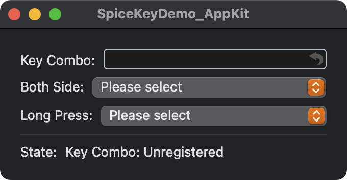
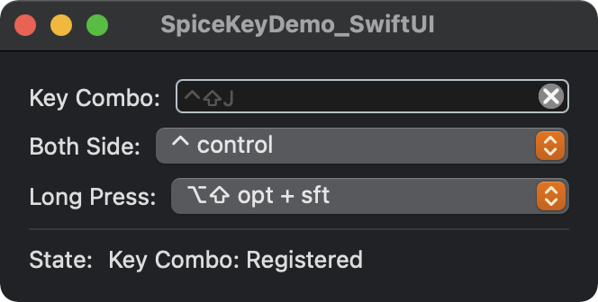

# SpiceKey

Global Shortcuts for macOS written in Swift.

## Demo

Demo App is in this Project.




## Usage

- Register a shortcut

Set `⌘ + A` shortcut.

```swift
let key = Key.a
let modifierFlags = ModifierFlags.cmd
let keyCombo = KeyCombination(key, modifierFlags)
let spiceKey = SpiceKey(keyCombo, keyDownHandler: {
    // process (key down)
}, keyUpHandler: {
    // process (key up)
})
spiceKey.register()
```

Set `press both side of ⌘` shortcut.

```swift
let flag = ModifierFlag.command
let spiceKey = SpiceKey(flag, bothModifierKeysPressHandler: {
    // process (press)
}, releaseKeyHandler: {
    // process (release)
})
spiceKey.register()
```

Set `long press ⌘` shortcut.

```swift
// run after 0.6 sec
let flags = ModifierFlags.cmd
let spiceKey = SpiceKey(flags, 0.6, modifierKeysLongPressHandler: {
    // process (press)
}, releaseKeyHandler: {
    // process (release)
})
spiceKey.register()
```

- Create a Key and a ModifierFlags from NSEvent.

```swift
func example(event: NSEvent) {
    let key = Key(keyCode: event.keyCode)
    let flags = event.modifierFlags.intersection(.deviceIndependentFlagsMask)
    let modifierFlags = ModifierFlags(flags: flags)
}
```

- Get a description of the shortcut

```swift
let description = modifierFlags.string + key.string
// or
let description = keyCombination.string
```

- Unregister a shortcut

```swift
spiceKey.unregister()
```

- Save shortcut

```swift
let key = Key.a
let flags = ModifierFlags.optCmd
let spiceKey = SpiceKey(...)

let spiceKeyData = SpiceKeyData(_ primaryKey: String,
                                _ keyCode: CGKeyCode,  // key.keyCode
                                _ control: Bool,       // flags.containsControl
                                _ option: Bool,        // flags.containsOption
                                _ shift: Bool,         // flags.containsShift
                                _ command: Bool,       // flags.containsCommand
                                _ spiceKey: SpiceKey)  // spiceKey
// OR
let spiceKeyData = SpiceKeyData(_ primaryKey: String,
                                _ key: Key,
                                _ modifierFlags: ModifierFlags,
                                _ spiceKey: SpiceKey)

let data = try! NSKeyedArchiver.archivedData(withRootObject: spiceKeyData,
                                             requiringSecureCoding: false)
UserDefaults.standard.set(data, forKey: "spiceKeyData")
```

- Load shortcut

```swift
let data = UserDefaults.standard.data(forKey: "spiceKeyData")!
let spiceKeyData = try! NSKeyedUnarchiver
    .unarchiveTopLevelObjectWithData(data) as! SpiceKeyData
```

## SpiceKeyField & SKTextField

A special text field that can be used to register SpiceKey.

- SpiceKeyField is for AppKit only.
- SKTextField is a SpiceKeyField made available from SwiftUI.

Please see the Demo App for detailed instructions.
